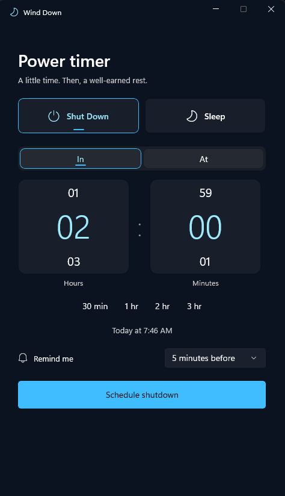

# Wind Down

A native Windows 11 utility for scheduling **Shut Down** or **Sleep**, built with C#, WinUI 3 and Windows App SDK.

## Screenshot

<p align="center">
  
</p>

## Install

Run this one-line bootstrap in PowerShell. It downloads the Windows x64 app from the latest release and the installer integration from this official repository, then installs everything for the current user. Administrator rights are not required.

```powershell
irm https://raw.githubusercontent.com/SnoozeWalknn/Wind-Down/main/install.ps1 | iex
```

After installation, use `wind-down` from PowerShell or Command Prompt to open the app. The installer also adds Wind Down to the Start menu and **Settings → Apps → Installed apps**.

```text
wind-down             Open Wind Down
wind-down repair      Restore the command, shortcut, and Installed Apps entry
wind-down uninstall   Uninstall Wind Down
```

If an already-open terminal does not recognize `wind-down`, open a new terminal once so it receives the updated user PATH.

## Portable use

Download `Wind-Down-1.0-Windows-x64.zip` from the latest release, extract it, and open **Wind Down.exe**. Keep the entire folder together. The x64 release includes .NET and Windows App SDK runtimes; no Visual Studio, administrator rights, or separate runtime install is required.

Portable use remains installation-free. If you later want a permanent per-user installation, run **Install.ps1** from the extracted folder; this is equivalent to `wind-down install`.

The release is unsigned, so Windows may show its standard warning for software from an unknown publisher.

## Use

- **In:** choose 0–24 hours and 0–59 minutes, or use a quick preset. At 24 hours, minutes are fixed at 00; the minimum is 1 minute.
- **At:** choose the next occurrence of a clock time. Windows regional settings determine 12/24-hour display. Today/Tomorrow is shown before scheduling.
- Type directly into a dial, use Up/Down, scroll, or swipe. Tab moves between controls; Enter confirms the dial or activates a focused button.
- Choose Shut Down (default) or Sleep, select a reminder, and schedule.
- Close the active window to keep it in the tray. Open Wind Down again to return to the same instance. Cancel from the window, tray menu, or the reminder's cancellation link.
- Use Settings for System, Light, or Dark appearance. **Exit Wind Down** closes the app while leaving an active Windows-owned schedule intact.

## Scheduling behavior

Windows Task Scheduler owns the deadline and execution result, independently of the visible app. Closing or crashing Wind Down does not cancel a schedule. The countdown is calculated from the actual UTC deadline.

Stay signed in. Wind Down does not wake the PC to act. Missed deadlines and schedules created before a Windows restart are skipped, so reopening or waking the PC does not trigger a surprise power action. Windows may delay a task briefly; execution more than one minute late is skipped. A future schedule in the same boot survives ordinary sleep/wake. A selected time is fixed to its resolved instant; changing the time zone changes its displayed clock time.

Shutdown protects unsaved work: Wind Down does not force apps or other users to close. Windows may block shutdown. Sleep depends on the PC's capabilities. Wind Down distinguishes a registered schedule, an accepted power request, a missed deadline, and an API failure; API acceptance does not prove the PC powered off.

Reminders follow Windows notification settings and Do Not Disturb. For durations shorter than the selected warning interval, the reminder is immediate. Warning delivery is best effort; it is never required for the power task to execute.

## Build and verify

Use Windows 11 x64 and .NET 8 SDK. Run `./Build.ps1 -Smoke` for the small packaging smoke pass or `./Build.ps1 -Test` for the complete scheduling suite. The first build restores Microsoft's NuGet dependencies. A solution file is included for Visual Studio with the Windows application development workload.

The build produces `artifacts/Wind-Down-1.0-Project`, `artifacts/Wind-Down-1.0-Windows-x64`, and `artifacts/Wind-Down-1.0-Windows-x64.zip`. The project folder contains the development master without build caches; the Windows folder and ZIP contain the self-contained friend-ready application without source, tests, symbols, or project files.

Tests use an isolated per-user task and an inert worker mode. **They never call a shutdown or sleep API.** See `docs/Verification.md` for checks performed and the remaining physical-device acceptance checks.

The design, state transitions, timing policy, and platform constraints are documented in `docs/Architecture.md`.

## Uninstall

Cancel any active schedule, choose **Exit Wind Down**, then use either method:

```powershell
wind-down uninstall
```

Or open **Settings → Apps → Installed apps**, find **Wind Down**, and choose **Uninstall**. The uninstaller refuses removal while a Wind Down power schedule remains active. It removes only Wind Down's installed files, shortcut, command PATH entry, protocol registration, Installed Apps record, and scheduled tasks. Appearance preferences remain in `%LOCALAPPDATA%\Wind Down`.

No service, startup task, password, or elevated task is installed.
